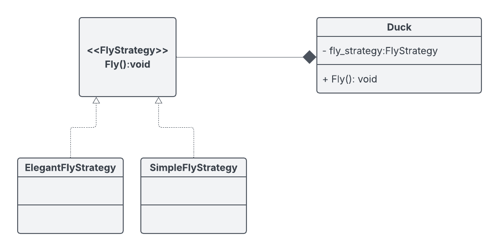
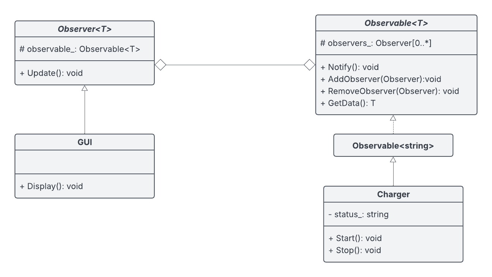
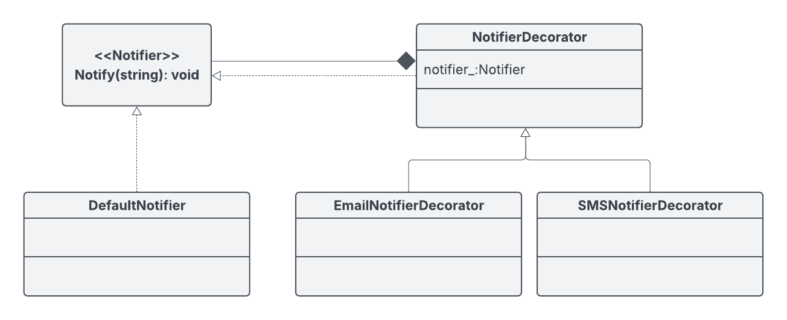
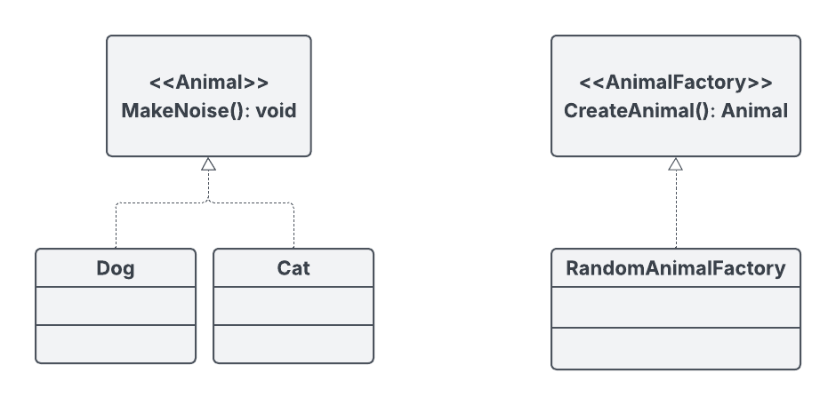
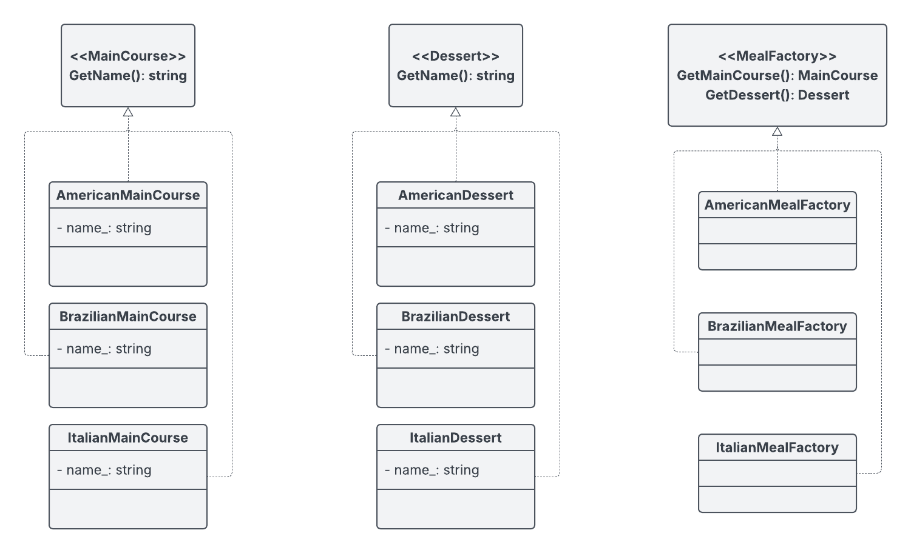

# Design Patterns
Generic solutions to common programming problems.
## Behavioral
### Strategy
Encapsulate implementations behind a common interface, allowing the behavior to vary independently from the clients that use it.

### Observer
The observable maintains a list of observers and calls each observer’s `Update()` function in its `Notify()` function.
So, when it wants to notify the observers that its state has changed, it calls `Notify()`.

## Structural
### Decorator
Wraps an interface that it implements itself, using dependency injection to create a chain (or stack) of function calls,
allowing combined behavior. The difference from the [Strategy Pattern](#strategy) is that the Decorator Pattern can combine multiple behaviors by wrapping objects,
whereas the Strategy Pattern allows only one behavior at a time. 

## Creational
### Factory Method
Defines a common interface for creating objects, letting subclasses decide how to instantiate them.
The objects created must share a common interface.

### Abstract Factory
Similar to [Factory Method](#factory-method), the Abstract Factory creates objects, but the difference
is that it creates related instances of the same or different class.

